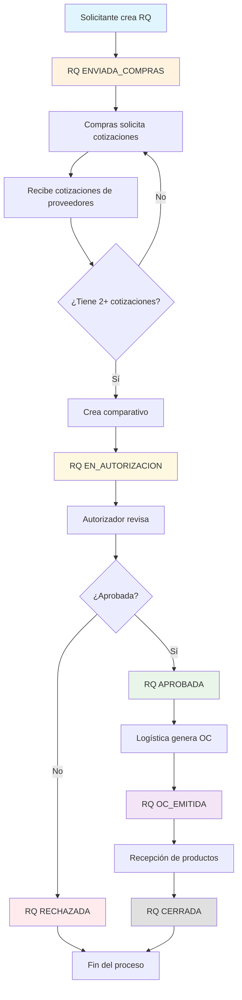

## Flujo de Trabajo del Sistema de Requisiciones

### Fases del Proceso

#### 1. Inicio del Proceso
- **Solicitante** crea una nueva RQ especificando:
  - Proyecto asociado
  - Centro de costo (opcional)
  - Lista de ítems con cantidades y especificaciones
  - La RQ pasa automáticamente a estado **ENVIADA_COMPRAS**

#### 2. Gestión de Cotizaciones
- **Compras** ve la RQ en su dashboard
- Solicita cotizaciones a múltiples proveedores
- Recibe y registra cotizaciones
- Una vez con 2+ cotizaciones, crea el comparativo
- La RQ pasa a estado **EN_AUTORIZACION**

#### 3. Proceso de Autorización
- **Autorizador** revisa el comparativo
- Completa lista de verificación
- Decide aprobar o rechazar con comentarios
- Si aprueba: **APROBADA**
- Si rechaza: **RECHAZADA** (fin del proceso)

#### 4. Generación de Orden de Compra
- **Logística** genera la orden de compra
- Selecciona el proveedor del comparativo
- La RQ pasa a **OC_EMITIDA**

#### 5. Recepción y Cierre
- **Logística** gestiona la recepción
- Una vez recibido, la RQ pasa a **CERRADA**

### Roles y Responsabilidades

| Rol | Responsabilidades | Dashboard |
|-----|------------------|-----------|
| **Solicitante** | Crear RQs, hacer seguimiento | Mis requisiciones activas |
| **Compras** | Gestionar cotizaciones y comparativos | RQs pendientes de cotización |
| **Autorizador** | Aprobar/rechazar basándose en comparativos | RQs pendientes de autorización |
| **Logística** | Generar OCs y gestionar recepción | OCs pendientes |
| **Tesorería** | Gestionar pagos | Pagos pendientes |
| **Admin** | Configurar sistema y usuarios | Vista completa |
